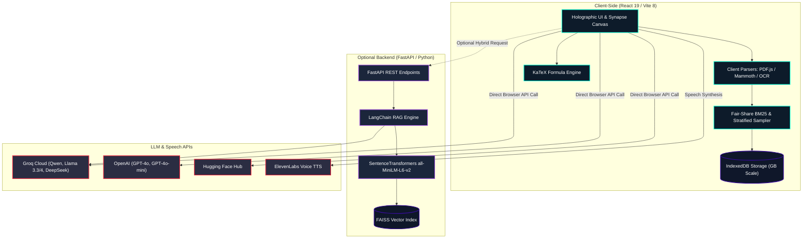

# NeuroLens Knowledge Retrieval Engine 🧠✨

<div align="center">


[](https://react.dev/)
[](https://vitejs.dev/)
[](https://fastapi.tiangolo.com/)
[](https://langchain.com/)
[](https://github.com/facebookresearch/faiss)
[](https://katex.org/)
[](https://opensource.org/licenses/MIT)

**A Next-Generation, Dual-Architecture Document Retrieval-Augmented Generation (RAG) System featuring Multi-PDF Global Awareness, Real-time KaTeX LaTeX Rendering, and Cyberpunk Sci-Fi Glassmorphism.**

[Live Demo](https://udityamerit.github.io/NeuroLens-Knowledge-Retrieval-Engine/) • [Architecture](#-architecture-overview) • [Key Features](#-key-features) • [Installation](#-setup--installation) • [Author](#-author)

</div>

---

## 🌟 Overview

**NeuroLens** is a high-performance Document Retrieval-Augmented Generation (RAG) platform designed to ingest, index, and analyze complex documents with sub-millisecond retrieval speeds and zero context starvation. 

It provides **Dual Execution Modes**:
1. **Zero-Backend Standalone Mode (Browser-Native)**: Runs 100% inside your web browser (ideal for GitHub Pages / static hosting). PDF parsing (PDF.js), DOCX extraction (Mammoth), chunking, BM25 fair-share ranking, and IndexedDB persistence all execute client-side.
2. **Full-Stack Hybrid Mode (FastAPI + FAISS)**: High-throughput Python server leveraging SentenceTransformers (`all-MiniLM-L6-v2`) and FAISS vector databases for dense semantic search.

---

## 🚀 Key Features

### 📚 Multi-Document Fair-Share Intelligence
- **Fair-Share Round-Robin Retrieval (`searchBM25MultiDoc`)**: Solves single-document context starvation. Retrieved context passages are fairly distributed across all active documents so long files do not drown out shorter ones.
- **Dynamic Context Quotas**: Scales retrieved chunks dynamically based on library size ($k = \max(k, \min(\text{documents.length} \times 3, 15))$).
- **Cross-Document Stratified Summarization**: When asked to "summarize all" or "compare documents", NeuroLens pulls opening abstracts, core body sections, and conclusions from *every single uploaded file*.
- **Executive Catalog Awareness**: Injects a structured catalog containing file names, page counts, chunk metrics, and opening synopses directly into the LLM system prompt for 100% inventory awareness.
- **Ground Truth Override & History Isolation**: Internal system notifications (uploads, deletions, URL scrapes) are filtered from chat history, ensuring re-added files (e.g. `cap1.pdf`) are recognized with live ground truth priority.

### 📐 Beautiful KaTeX LaTeX Mathematical Rendering
- **Full LaTeX Math Support**: Automatically renders display equations (`$$...$$`, `\[...\]`, `\begin{equation}...\end{equation}`, `\begin{cases}...\end{cases}`, matrices, fractions, integrals) and inline formulas (`$...$`, `\(...\)`).
- **Document Preview Math Rendering**: Mathematical formulas within uploaded PDFs and DOCX files render with KaTeX inside the chunk preview modal.
- **Neon Math Aesthetics**: Styled with responsive overflow scrollbars and subtle sci-fi cyan glow.

### 🤖 Modern Free & Production LLM Catalog
- **Groq Free Models**: Pre-configured with the latest ultra-fast models including:
  - `qwen/qwen3.8-27b` (Default recommended free model)
  - `deepseek-r1-distill-llama-70b`
  - `meta-llama/llama-4-scout-17b-16k`
  - `llama-3.3-70b-versatile`
  - `llama-3.1-8b-instant`
- **OpenAI Integration**: Native support for `gpt-4o`, `gpt-4o-mini`, and custom models.
- **Hugging Face Hub**: Compatible with Hugging Face Serverless Inference Endpoints.
- **Automatic Legacy Migration**: Deprecated models (such as `llama-3-8b-8192` or `mixtral-8x7b-32768`) are automatically migrated to high-performance active alternatives.

### 🛡️ Privacy & Secure Key Management
- **Zero-Exposure Key Storage**: All API keys are stored locally in the browser with obfuscation. Keys are never printed in public console logs, never shared with third parties, and never sent to our servers.
- **Interactive Security Shield**: Settings modal features a password mask toggle, direct links to free API dashboards, and real-time validation badges.

### 🎙️ Voice & Multimodal Interaction
- **Dual TTS Engine**: Integrated **ElevenLabs** neural speech synthesis with seamless automatic fallback to the **Web Speech API**.
- **Math-to-Speech Parser**: Converts LaTeX formulas and code blocks into natural, speakable English or Hindi so voice synthesis sounds fluent.
- **Voice Speech-to-Text Input**: Dictate your questions directly via browser microphone with dual English/Hindi language toggles.
- **Camera OCR Scanner**: Scan physical pages or whiteboards using your device camera or upload image files directly.

### 🔮 Immersive Sci-Fi Holographic Interface
- **Dynamic Neural Synapse Canvas**: An interactive, physics-based network animation with drifting nodes and glowing electrical impulses traveling across synaptic pathways.
- **Active Document Scope Pill**: Toggle between querying **All Sources** or **Focus Mode** on a single specific document with a single click.
- **Responsive Mobile Drawer**: Full mobile, tablet, and desktop responsiveness with slide-out sidebar overlay.

---

## 🛠️ Architecture Overview



---

## 📂 Supported File Types & Ingestion

| Source Type | Extension | Ingestion Method | Features |
| :--- | :--- | :--- | :--- |
| **PDF Documents** | `.pdf` | PDF.js / PyPDF | Multi-page text extraction, page tracking, LaTeX math preservation |
| **Word Documents** | `.docx` | Mammoth / python-docx | Preserves paragraph hierarchy and clean body text |
| **Plain Text** | `.txt`, `.md` | TextDecoder / Native | Fast direct text parsing |
| **Webpages / URLs** | `http://`, `https://` | AllOrigins Proxy / BeautifulSoup | Ingests documentation, articles, and blogs directly from links |
| **Images & Camera** | `.png`, `.jpg`, `.jpeg` | Vision LLM OCR | Scans text and math equations from photos and physical notes |

---

## ⚡ Setup & Installation

### Prerequisites
- **Node.js** (v18 or higher)
- **Python** (v3.10 or higher — *optional, only needed for backend FAISS mode*)

### Quick Start (Windows)
Double-click `run.bat` or run:
```powershell
.\run.bat
```
*This automatically initializes the Python virtual environment, installs dependencies, and launches both the backend on `http://localhost:8000` and the frontend on `http://localhost:5173`.*

---

### Manual Setup

#### 1. Frontend Setup (Standalone or Connected)
```bash
cd frontend
npm install
npm run dev
```
Open [http://localhost:5173](http://localhost:5173) in your browser.

#### 2. Backend Setup (Optional FAISS Acceleration)
```bash
cd backend
python -m venv venv

# On Windows:
venv\Scripts\activate
# On macOS/Linux:
source venv/bin/activate

pip install -r requirements.txt
python app.py
```
FastAPI server runs at [http://localhost:8000](http://localhost:8000). Interactive Swagger documentation is available at `http://localhost:8000/docs`.

---

## 🔑 Environment Configuration

You can enter your API keys directly into the **Settings UI** in your browser, or configure a `.env` file in the project root:

```env
# Optional: Pre-fill API keys
GROQ_API_KEY=gsk_your_groq_api_key_here
OPENAI_API_KEY=sk_your_openai_key_here
HF_TOKEN=hf_your_huggingface_token_here
ELEVENLABS_API_KEY=your_elevenlabs_key_here
```

> 💡 **Tip**: Groq API keys are **100% free** and provide instant access to `qwen/qwen3.8-27b` and `llama-3.3-70b-versatile` at over 300+ tokens/second. You can get a free key at [console.groq.com](https://console.groq.com/keys).

---

## 🌐 Production Deployment (GitHub Pages)

The frontend is fully configured for automated GitHub Pages continuous deployment:
1. Fork or clone this repository.
2. In `frontend/vite.config.js`, verify the `base` path matches your repo name:
   ```javascript
   export default defineConfig({
     plugins: [react()],
     base: '/NeuroLens-Knowledge-Retrieval-Engine/',
   })
   ```
3. Push to the `main` branch. The automated workflow `.github/workflows/deploy.yml` will build and publish the application to GitHub Pages.

---

## 🧪 Testing

### Frontend Production Build
```bash
cd frontend
npm run build
```

### Formula Rendering Verification
```bash
cd frontend
node test_formula.mjs
```

### Backend Diagnostics
```bash
python scratch/test_gpt_oss.py
```

---

## 📄 License

This project is licensed under the **MIT License** — see the [LICENSE](LICENSE) file for details.

---

## 👨‍💻 Author

**Uditya Narayan Tiwari**  
*Machine Learning Engineer & Generative AI Developer*  
Specializing in AI/ML, B.Tech CSE (AI & ML) at VIT Bhopal University.

- 🌐 **Portfolio**: [udityanarayantiwari.netlify.app](https://udityanarayantiwari.netlify.app/)
- 🐙 **GitHub**: [@udityamerit](https://github.com/udityamerit)
- 💼 **LinkedIn**: [Uditya Narayan Tiwari](https://www.linkedin.com/in/uditya-narayan-tiwari-562332289/)
- 🧠 **Knowledge Base**: [udityaknowledgebase.netlify.app](https://udityaknowledgebase.netlify.app/)

<div align="center">
  <sub>Engineered with precision for seamless document intelligence. If you find this project helpful, please give it a ⭐️!</sub>
</div>
