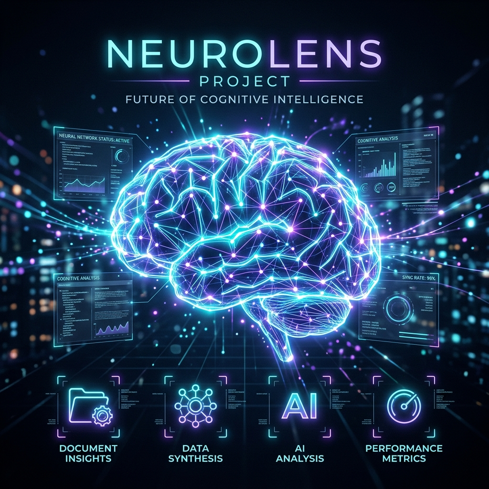
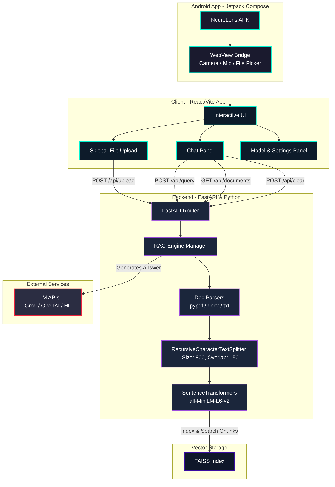
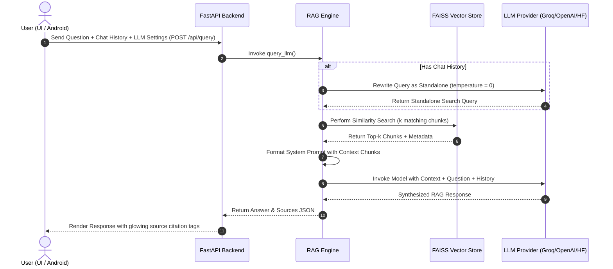

# NeuroLens Knowledge Retrieval Engine



**NeuroLens** is a premium, state-of-the-art Document Retrieval-Augmented Generation (RAG) system. It combines an immersive, holographic, sci-fi-themed React frontend with a high-performance FastAPI backend.

NeuroLens allows users to upload local documents (PDF, DOCX, TXT), index them into a local **FAISS vector database** using **SentenceTransformers embeddings**, and query them interactively with contextual history. It integrates seamlessly with multiple LLM API providers like **Groq**, **OpenAI**, and **Hugging Face Hub** for synthesizing intelligent, citation-backed answers.

---

## 📱 Android App — Download & Install

NeuroLens is now available as a native **Android application**! Download and install it directly on any Android phone (Android 7.0+).

<p align="center">
  <a href="https://github.com/udityamerit/NeuroLens-Knowledge-Retrieval-Engine/releases/download/v1.0.0/NeuroLens-v1.0.0.apk">
    
  </a>
  &nbsp;
  <a href="https://github.com/udityamerit/NeuroLens-Knowledge-Retrieval-Engine/releases/tag/v1.0.0">
    
  </a>
</p>

### 📲 Install Instructions
1. Tap the **Download APK** badge above (or [click here](https://github.com/udityamerit/NeuroLens-Knowledge-Retrieval-Engine/releases/download/v1.0.0/NeuroLens-v1.0.0.apk)) on your Android phone
2. Open the downloaded `.apk` file from your notification bar or Downloads folder
3. If prompted, tap **"Allow from this source"** to enable sideloading
4. Tap **Install**, then open **NeuroLens** from your app drawer!

### 📦 Android App Features
- **Full RAG workspace on mobile** — chat, upload documents, and get AI answers on the go
- **Camera document scanner** — capture pages and OCR them directly from your phone camera
- **Voice query support** — use your microphone to ask questions hands-free
- **File picker integration** — attach PDFs, DOCX, and TXT files from your phone storage
- **Groq (free), OpenAI & HuggingFace** API support — configure your provider in-app
- **Full-bleed immersive UI** — the holographic design renders natively edge-to-edge

### 🏗️ Android Architecture
The Android app is built using **Jetpack Compose** and wraps the hosted web application in a native **WebView** container:

```
android/
├── app/src/main/
│   ├── AndroidManifest.xml        # Internet, Camera, Microphone permissions
│   ├── java/com/example/neurolens/
│   │   ├── MainActivity.kt        # Entry point
│   │   ├── Navigation.kt          # Compose navigation host
│   │   └── ui/main/
│   │       └── MainScreen.kt      # WebView + permission handling
│   └── res/
│       └── drawable/              # Custom NeuroLens brand icons
```

> **Requirements:** Android 7.0 (API 24) or higher · ~11 MB download size

---

## 🚀 Key Features

*   **Immersive Holographic UI:** Custom-built glassmorphism design with interactive, physics-based neural synapse canvas animations responding to user interactions.
*   **Local Document Ingestion:** Drag-and-drop support for PDF, Word documents (.docx), and Plain Text (.txt) files.
*   **URL Content Fetching:** Paste any webpage URL to extract and index its content as a knowledge source.
*   **Vector Search & Embeddings:** Employs LangChain, `sentence-transformers/all-MiniLM-L6-v2` embeddings, and a `FAISS` index to run sub-millisecond semantic retrieval locally.
*   **Smart Conversational Rephrasing:** Evaluates active user query history to construct self-contained, standalone search terms before running semantic retrieval.
*   **Multi-Provider Integration:** Custom-configured settings supporting Groq (Llama-3.3, etc.), OpenAI (GPT-4o, etc.), and Hugging Face Hub inference API pipelines.
*   **Granular Citation Support:** Displays glowing, interactive source citations mapping exact text passages and PDF pages matching the generated answers.
*   **Camera OCR Scanner:** Capture documents with your camera and extract text for indexing.
*   **Chat Without Documents:** Ask general questions or chat directly without uploading any files.
*   **Android Mobile App:** Native Jetpack Compose app with full WebView integration and hardware permission support.
*   **Lightweight Deployment & Storage:** Features automatic temporary file cleanups and vector store index serialization locally.

---

## 🛠️ Architecture Overview

NeuroLens is designed as a decoupled client-server architecture.

1.  **Frontend (React/Vite):** Renders the modular interface components (Sidebar, Chat Panel, Settings, and Author modals). Manages local settings configuration, document ingestion status, and query dispatching.
2.  **Backend (FastAPI):** Exposes RESTful API endpoints for file uploads, query execution, document list registry, and database clearing.
3.  **RAG Engine (LangChain/FAISS):** Oversees text extraction, recursive character splitting (size: 800, overlap: 150), vector search matching, and API orchestration with LLM providers.
4.  **Android App (Jetpack Compose):** Native Android wrapper loading the hosted frontend via a feature-rich WebView with camera, microphone, and file picker bridge support.

### System Architecture



### RAG Query Pipeline Flow



---

## ⚡ Setup & Installation

### Prerequisites

*   **Node.js** (v18 or higher)
*   **Python** (v3.10 or higher)

### Environment Configurations

Create a `.env` file in the project's root folder to configure backend LLM credentials (optional; you can also paste them directly into the frontend Settings UI):

```env
GROQ_API_KEY=your_groq_api_key
OPENAI_API_KEY=your_openai_api_key
HF_TOKEN=your_hugging_face_token
```

### Automated Start (Windows)

Simply run the double-click helper batch script:

```bash
run.bat
```

This will automatically create a virtual environment, install Python/Node dependencies, and start both the FastAPI backend (on port `8000`) and the Vite development server (on port `5173`).

---

## 📦 Manual Setup

### 1. Backend

Navigate to the `backend` folder:

```bash
cd backend
```

Create a virtual environment and activate it:

```bash
python -m venv venv
# On Windows
venv\Scripts\activate
# On macOS/Linux
source venv/bin/activate
```

Install requirements:

```bash
pip install -r requirements.txt
```

Launch the FastAPI server:

```bash
python app.py
```

### 2. Frontend

Navigate to the `frontend` folder:

```bash
cd frontend
```

Install dependencies:

```bash
npm install
```

Launch Vite local development server:

```bash
npm run dev
```

### 3. Android App (Build from Source)

Requires **Android Studio** or **Java 17+** with Android SDK installed.

```bash
cd android
./gradlew assembleDebug
```

The compiled APK will be at:
```
android/app/build/outputs/apk/debug/app-debug.apk
```

> Or simply **[download the pre-built APK](https://github.com/udityamerit/NeuroLens-Knowledge-Retrieval-Engine/releases/download/v1.0.0/NeuroLens-v1.0.0.apk)** — no build required!

---

## 🌐 Production Deployment

The frontend of this application is pre-configured for GitHub Pages deployment. To deploy your own instance:

1.  Make sure the `base` property in `frontend/vite.config.js` matches your GitHub repository name:
    ```javascript
    export default defineConfig({
      plugins: [react()],
      base: '/<repository-name>/',
    })
    ```
2.  Push to `main`/`master` to trigger the automated GitHub Actions deployment workflow defined in `.github/workflows/deploy.yml`.

---

## 📄 License

This project is licensed under the MIT License. See [LICENSE](LICENSE) for details.

---

<p align="center">
  Built with ❤️ by <a href="https://udityanarayantiwari.netlify.app/">Uditya Narayan Tiwari</a> &nbsp;|&nbsp;
  <a href="https://github.com/udityamerit">GitHub</a> &nbsp;|&nbsp;
  <a href="https://www.linkedin.com/in/uditya-narayan-tiwari-562332289/">LinkedIn</a>
</p>
